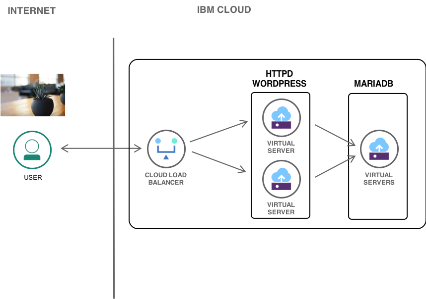
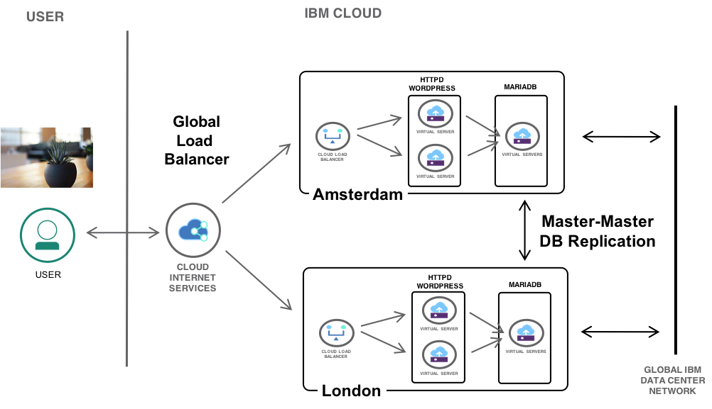

# Wordpress_ansible_ibmcloud

Demo ansible package to install Wordpress in a highly available 3-tier configuration on IBM Cloud
 - IBM Cloud Load Balancer
 - httpd app server
 - mariadb 

This pacakge supports two configuration options, 
- Single site deployment of multiple httpd webservers with a single Mariadb database host with an IBM Cloud Load Balancer (CLB) as a local LB. 
- Dual site high availability configuration, with webservers and DB's deployed in two data centers, each with CLBs, fronted by IBM Cloud Internet Services (CloudFlare) as a global load balancer. 

Deployment architecture is determined dynamically based on Ansible inventory file specifying two Mariadb servers in different data centers. The inventory file can be statically specified with manual deployment of hosts on IBM Cloud, or used with Ansible dynamic inventory with Terraform automated deployment of servers and LBs.  

  

  

This package uses three excellent Ansible roles maintained by Bert Van Vreckem and team. The roles are force included in this package as a small number of changes where made to support usage in this configuration. 

https://github.com/bertvv/ansible-role-mariadb
https://github.com/bertvv/ansible-role-wordpress
https://github.com/bertvv/ansible-role-httpd

DB replication setup is based on the work of Vitalii Michailovich
https://github.com/VitaliiMichailovich/Ansible-MySQL-Master-Master

